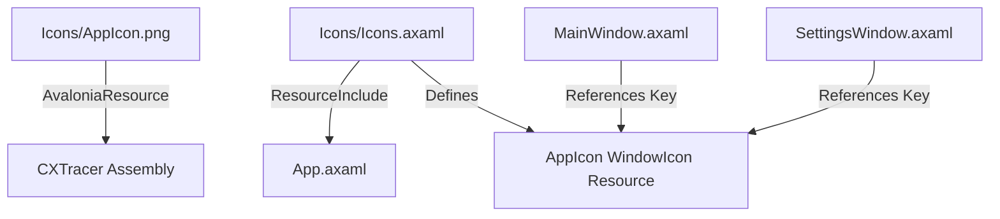

# Design: Add App Icon

## Data Flow & Reference Structure

- **Assembly Packaging**: `CXTracer.csproj` packages everything in the `Icons` folder via globbing (`<AvaloniaResource Include="Icons\**" />`). Thus, `/Icons/AppIcon.png` is embedded.
- **Resource Dictionary**: `AppIcon` is declared inside `Icons.axaml` as a `WindowIcon` which uses a TypeConverter to load `/Icons/AppIcon.png` from the assembly resource table.
