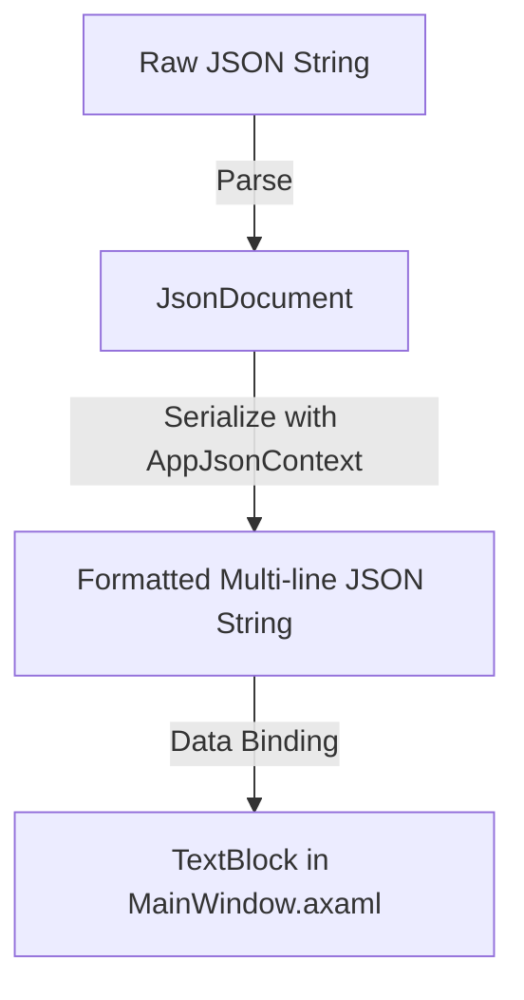

# Design: Format Raw Events Display

## Architecture & Layout
The bottom panel displays the "Raw events" list, which represents events that do not go into the Conversation or Execution transcripts (such as token streams, model plans, or parse errors).



## UI Component Layout
Each Raw Event item will be structured as a small card within the bottom scroll viewer, acting as an interactive border:

```text
+-------------------------------------------------------------+
|  #12 · 18:30:12 · Raw Event                                 |
|  ---------------------------------------------------------  |
|  {                                                          |
|    "event": "model_thinking",                               |
|    "text": "..."                                            |
|  }                                                          |
+-------------------------------------------------------------+
```

- **Card Outer Border**: Background color `#FAFAFA`, Border color `#EFEFEF`, CornerRadius `8`, Margin `0,0,0,10`, Padding `10`.
  - Event handler: `PointerPressed="CardBorder_PointerPressed"` to open detail popup on left click and copy text on right click.
- **Card Header**:
  - Left: Event line number and time badge (e.g. `[18:30:12]`).
  - Right: Role/Event Kind (e.g., `Raw`).
- **Card Body**:
  - `TextBlock` bound to `FormattedRawJson`.
  - `FontFamily="Consolas"`, `FontSize="12"`, `Foreground="#4A4640"`, `TextWrapping="NoWrap"` (horizontal scroll viewer is parent).
