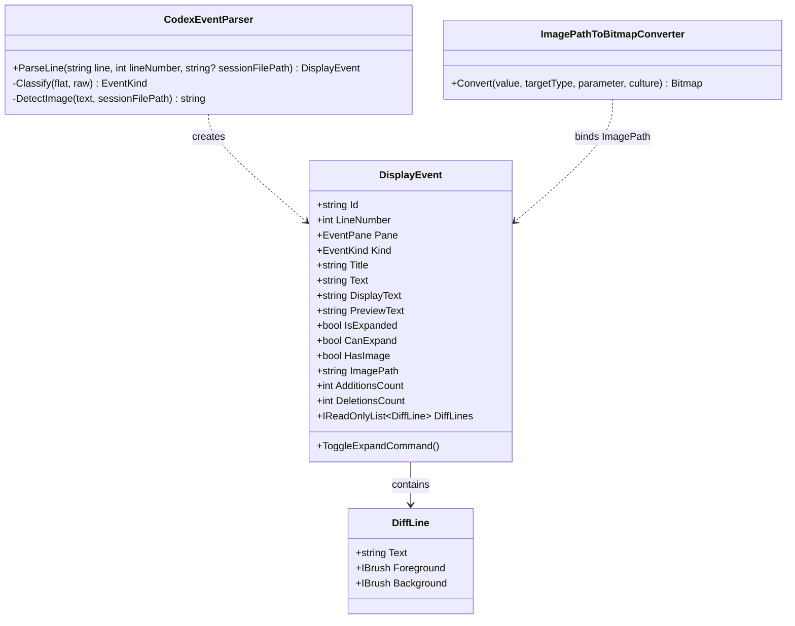

# Design Specification - Enhance UI Features

This document describes the technical architecture and UI integration plan for rendering images, collapsible tool logs, and syntax-highlighted diffs in CXTracer.

## 1. Class Diagram & Architecture Boundaries



### EventKind Additions

We will introduce new items to `EventKind.cs`:
```csharp
public enum EventKind
{
    // ... Existing
    ToolCall,
    ToolResult,
    // ...
}
```

## 2. Component Design & Contracts

### 2.1 DisplayEvent Enhancements
- **CanExpand**: True if `Kind` is `ToolCall`, `ToolResult`, `Diff`, `CommandOutput`, or if `Text.Length > 200` or has more than 3 lines.
- **PreviewText**: Returns the first 3 lines or first 200 characters of `Text` with `...`.
- **DisplayText**: A computed property that returns `PreviewText` if `CanExpand && !IsExpanded`, otherwise `Text`. Triggered for updates when `IsExpanded` changes.
- **DiffLines**: If `Kind == EventKind.Diff`, parsed line-by-line:
  - Line starts with `+` (and not `+++`): green line (`#2E7D32` text, `#E8F5E9` bg).
  - Line starts with `-` (and not `---`): red line (`#C62828` text, `#FFEBEE` bg).
  - Line starts with `@@` or metadata: teal/gray line (`#00796B` text, `#E0F2F1` bg).
  - Other lines: default text/bg.
- **ImagePath**: Parsed from `Text`. Supports base64 or absolute/relative file paths.
- **IsExpanded**: Initialized using the hybrid default rules:
  - Left panel kinds (`User`, `Assistant`, `Final`): `true`.
  - Right panel kinds (`Diff`, `ToolCall`, `ToolResult`, `Command`, `CommandOutput`, `Error`): `true` if content is short (<= 150 chars AND <= 3 lines), otherwise `false`.
- **ResetExpansionState(bool expandAllByDefault)**: Method to dynamically re-evaluate the expansion state. If `expandAllByDefault` is true, sets `IsExpanded = true`. Otherwise, applies the standard hybrid default expansion rules.

### 2.2 Settings & Configuration Design
- **AppSettings**: Add `ExpandAllEventsByDefault` property.
- **MainWindowViewModel**: Exposes `ExpandAllEventsByDefault` property, saves settings on change, and invokes `ResetExpansionState` for all loaded events in the active list.
- **SettingsWindowViewModel & SettingsWindow**: Bind a new checkbox control under the Navigation section to toggle `ExpandAllEventsByDefault`.

### 2.3 Parser Updates (`CodexEventParser.cs`)
- Update `ParseLine(string line, int lineNumber, string? sessionFilePath)` to receive the path of the `.jsonl` session file.
- Update `Classify()`:
  - If payload type is `custom_tool_call` or contains `tool_call` -> `EventKind.ToolCall`.
  - If payload type is `custom_tool_call_output` or contains `tool_result`/`tool_output` -> `EventKind.ToolResult`.
- Image Detection Regexes:
  - Markdown image: `!\[.*?\]\((.*?)\)`
  - HTML image: `]*src=["'](.*?)["']`
  - Standalone image paths: lines ending in `.png`, `.jpg`, `.jpeg`, `.webp`, `.gif`.
- Path resolution logic:
  - Convert `~` to `UserProfile`.
  - If relative path, combine with `Path.GetDirectoryName(sessionFilePath)`.
  - WSL and Unix path translation:
    - Map `/mnt/drives` (e.g., `/mnt/c/...`) to Windows drive letters (e.g., `C:\...`).
    - Map absolute Unix paths (starting with `/`) to WSL UNC paths (e.g., `\\wsl$\...` or `\\wsl.localhost\...`) if the session file itself is located on a WSL mount.

### 2.3 Value Converter (`ImagePathToBitmapConverter.cs`)
- Register in `App.axaml` namespace.
- Supports base64 parsing: `data:image/x;base64,...` -> decodes to a memory stream and instantiates an Avalonia `Bitmap`.
- Supports file paths: reads file stream and loads `Bitmap`.
- Catch all exceptions, return `null`.

## 3. View (UI) Styling Integration

### 3.1 Converter Registration
```xml
<Window.Resources>
  <converters:ImagePathToBitmapConverter x:Key="ImagePathToBitmapConverter" />
</Window.Resources>
```

### 3.2 ListBox Item Template Changes
- Replace `Text` binding with `DisplayText`.
- Add an `Image` control bound to `ImagePath`:
```xml
<Border CornerRadius="8" ClipToBounds="True" MaxHeight="300" IsVisible="{Binding HasImage}" Margin="0,4,0,0">
  <Image Source="{Binding ImagePath, Converter={StaticResource ImagePathToBitmapConverter}}" Stretch="Uniform" />
</Border>
```
- In the card header, add:
  - Collapse/expand toggle button (visible if `CanExpand`).
  - Additions/deletions diff badge count (visible if `IsDiff`).
- Add conditional rendering for Diff lines:
  - If `IsDiff && IsExpanded` -> render an `ItemsControl` bound to `DiffLines`.
  - If `IsDiff && !IsExpanded` -> render the standard `TextBlock` showing `PreviewText`.

## 4. Compatibility & Native AOT
- Avoid any type reflection in JSON parsing.
- Use explicit bindings and converter definitions.
- Ensure all types are referenced in source generators for JSON context (`AppJsonContext`).
