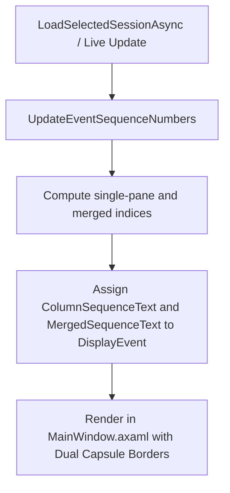

# Design Specification: Event Sequence Capsules

This document details the design for adding sequence number capsules to event cards in the Conversation and Execution panes.

## Architecture



### 1. Model Updates (`DisplayEvent.cs`)
- Added observable properties `ColumnSequenceText` and `MergedSequenceText` (string) to `DisplayEvent`.

### 2. ViewModel Logic (`MainWindowViewModel.cs`)
- Added a private helper `UpdateEventSequenceNumbers()`:
  ```csharp
  private void UpdateEventSequenceNumbers()
  {
      var sorted = _allEvents
          .Where(e => e.Pane is EventPane.Conversation or EventPane.Execution)
          .OrderBy(EventSortTimestamp)
          .ThenBy(e => e.LineNumber)
          .ToList();

      int convCount = 0;
      int execCount = 0;
      for (int i = 0; i < sorted.Count; i++)
      {
          var evt = sorted[i];
          int paneSeq;
          if (evt.Pane == EventPane.Conversation)
          {
              convCount++;
              paneSeq = convCount;
          }
          else
          {
              execCount++;
              paneSeq = execCount;
          }
          evt.ColumnSequenceText = paneSeq.ToString();
          evt.MergedSequenceText = (i + 1).ToString();
      }
  }
  ```
- Called `UpdateEventSequenceNumbers()`:
  - In `LoadSelectedSessionAsync`, immediately after loading all events into `_allEvents`.
  - In `HandleSessionFileChangedOnUiThreadAsync` (Live Update), after adding new events to `_allEvents` and before adding them to visible collections.

### 3. Visual Layout (`MainWindow.axaml`)
- Modified the item templates for `ConversationListBox` and `ExecutionListBox`.
- Displayed two separate warm-neutral capsules centered vertically alongside the timestamp:
  ```xml
  <StackPanel Grid.Column="1"
              Orientation="Horizontal"
              HorizontalAlignment="Right"
              Spacing="5"
              VerticalAlignment="Center">
    <Border Background="#F3EBE0"
            BorderBrush="#DDD5C8"
            BorderThickness="1"
            CornerRadius="999"
            Padding="5,1"
            MinWidth="22"
            HorizontalAlignment="Center"
            VerticalAlignment="Center"
            IsVisible="{Binding ColumnSequenceText, Converter={x:Static StringConverters.IsNotNullOrEmpty}}">
      <TextBlock Text="{Binding ColumnSequenceText}"
                 FontSize="11"
                 Foreground="#8A8178"
                 FontWeight="Medium"
                 HorizontalAlignment="Center"
                 VerticalAlignment="Center"/>
    </Border>
    <Border Background="#EDE5DA"
            BorderBrush="#DDD5C8"
            BorderThickness="1"
            CornerRadius="999"
            Padding="5,1"
            MinWidth="22"
            HorizontalAlignment="Center"
            VerticalAlignment="Center"
            IsVisible="{Binding MergedSequenceText, Converter={x:Static StringConverters.IsNotNullOrEmpty}}">
      <TextBlock Text="{Binding MergedSequenceText}"
                 FontSize="11"
                 Foreground="#8A8178"
                 FontWeight="Medium"
                 HorizontalAlignment="Center"
                 VerticalAlignment="Center"/>
    </Border>
    <TextBlock Text="{Binding TimeText}"
               FontSize="12"
               Foreground="#8A8178"
               VerticalAlignment="Center"/>
  </StackPanel>
  ```
