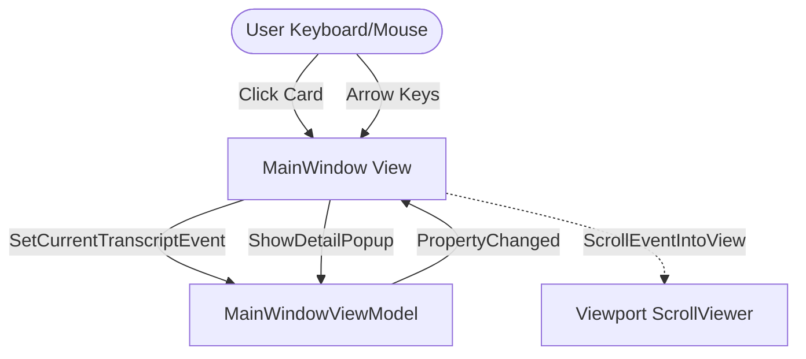

# Design: Select Search Item and Resume Navigation

This document covers the technical design for selecting cards within filtered search results, navigating via keyboard while the search TextBox is active, and retaining selection when resetting the filter.

## Architecture & Component Boundaries

## Technical Details

### 1. Pointer Event & Selection Update
In `MainWindow.axaml.cs` -> `CardBorder_PointerPressed`:
- On `IsLeftButtonPressed`:
  - Update selection: call `viewModel.SetCurrentTranscriptEvent(evt)`.
  - Shift focus away from the search TextBox: call `this.Focus()` to focus the MainWindow.
  - If `e.ClickCount == 2`:
    - Call `viewModel.ShowDetailPopup(evt)` to open the detail panel.
- In `MainWindow.axaml`:
  - Set `<Setter Property="Focusable" Value="False" />` in the `ListBox.transcriptList ListBoxItem` style. This prevents the clicked `ListBoxItem` from stealing keyboard focus and intercepting arrow key events, ensuring they always bubble to the MainWindow KeyDown handler.

### 2. Global Keyboard Navigation Bypass
In `MainWindow.axaml.cs` -> `Window_KeyDown`:
- Currently, if `IsTextInputFocused(e.Source)` is true, the handler returns early.
- Update this to check:
  - If `e.Key == Key.Up` or `e.Key == Key.Down`, bypass the text focus check and process list navigation normally.
  - Call `e.Handled = true` in navigation handlers to prevent the TextBox from performing any default behavior (though Up/Down keys have no function in single-line text boxes anyway).

### 3. Selection Retention in ViewModel
In `MainWindowViewModel.cs` -> `ApplyFilterAsync`:
- Retain the currently selected event rather than calling `SetCurrentTranscriptEvent(null)` unconditionally.
- Process:
  1. Capture `var previousSelected = CurrentTranscriptEvent;`.
  2. Clear and rebuild the filtered collections (`ConversationEvents`, `ExecutionEvents`, `RawEvents`).
  3. After the filtering loop completes, check if `previousSelected` is visible under the new filter conditions.
     - Specifically, check if the collection corresponding to its pane contains it.
  4. If it is visible, call `SetCurrentTranscriptEvent(previousSelected)`.
  5. If it is NOT visible, call `SetCurrentTranscriptEvent(null)`.

### 4. Automatic Scroll-into-view
To coordinate scrolling between the ViewModel and the View, we introduce a custom event in the ViewModel:
- `public event Action<DisplayEvent>? FilterAppliedScrollRequest;`
In `MainWindowViewModel.cs` -> `ApplyFilterAsync`:
- After restoring `previousSelected` as the current selected item, invoke `FilterAppliedScrollRequest?.Invoke(previousSelected);` if it remains visible.
In `MainWindow.axaml.cs`:
- Override `OnDataContextChanged` to subscribe to `FilterAppliedScrollRequest` when a ViewModel is set, and unsubscribe when it is changed.
- Implement `ViewModel_FilterAppliedScrollRequest(selected)` to execute `ScrollEventIntoView(selected)` via `Dispatcher.UIThread.Post(..., DispatcherPriority.Background)`.
- This ensures that when the asynchronous/debounced filtering completes, the view is cleanly and reliably scrolled back to the selected item.

## Alternatives and Trade-offs

- **Immediate scrolling on every selection**: We considered scrolling to the top on every property change of `CurrentTranscriptEvent`. However, this would cause the page to jump when clicking a card that is already partially visible. By only scrolling on explicit navigation or when the filter is cleared, we avoid jarring visual jumps during normal clicking.
- **Clearing focus on click**: Calling `this.Focus()` or `listBox.Focus()` when clicking a card ensures that subsequent keyboard events are captured directly by the window key down handler without any textbox interference.
