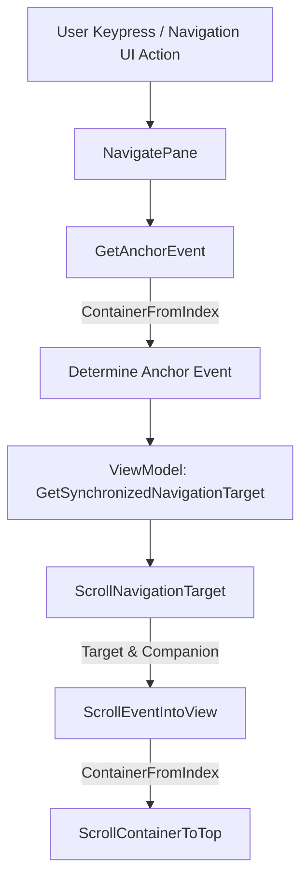

# Technical Design: Synchronized Navigation Scroll Optimization

This document outlines the optimization strategy for eliminating visual tree traversals during synchronized pane switching.

## Architecture and Boundaries

The synchronized navigation coordinate resolution is implemented entirely within the View layer of `MainWindow`:
- **File**: [MainWindow.axaml.cs](file:///k:/Code/ACTIVE/CXTracer/src/CXTracer/Views/MainWindow.axaml.cs)
- **State Source**: `MainWindowViewModel` publishes synchronization triggers and navigation targets.
- **Scroll Target**: `ScrollViewer` controls (`ConversationListBox` and `ExecutionListBox`).



## Coordinate Resolution Strategy

Since virtualization is disabled in CXTracer (standard `StackPanel` is used as the items panel), each container is materialized, and `ListBoxItem.Bounds.Y` represents its stable, static Y offset inside the scroll extent. We do not need `TranslatePoint` coordinate translations or items panel lookups.

### 1. Extent Bounds Resolution (`TryGetContainerExtentBounds`)
Directly read `item.Bounds.Y` and `item.Bounds.Height` from the `ListBoxItem`:
```csharp
private static bool TryGetContainerExtentBounds(
    ListBoxItem item,
    out double top,
    out double bottom)
{
    if (item is null || item.Bounds.Height <= 0)
    {
        top = 0;
        bottom = 0;
        return false;
    }

    top = item.Bounds.Y;
    bottom = top + item.Bounds.Height;
    return true;
}
```

### 2. Fast Anchor Search (`GetAnchorEvent`)
Instead of traversing, casting, and sorting all visual descendants, we sequentially inspect container layouts via `ContainerFromIndex`. Since items are laid out sequentially from top to bottom, we terminate search immediately when the Y-coordinate exceeds the viewport boundary:
```csharp
private DisplayEvent? GetAnchorEvent(ListBox listBox, ScrollViewer scrollViewer)
{
    const double topTolerance = 12;
    var targetY = scrollViewer.Offset.Y + topTolerance;
    DisplayEvent? candidate = null;

    for (int i = 0; i < listBox.Items.Count; i++)
    {
        var container = listBox.ContainerFromIndex(i) as ListBoxItem;
        if (container is null || !container.IsVisible) continue;

        if (TryGetContainerExtentBounds(container, out var top, out _))
        {
            if (top <= targetY)
            {
                candidate = listBox.Items[i] as DisplayEvent;
            }
            else
            {
                break;
            }
        }
    }

    if (candidate is null && listBox.Items.Count > 0)
    {
        candidate = listBox.Items[0] as DisplayEvent;
    }
    return candidate;
}
```

### 3. Container Retrieval (`TryGetEventContainer`)
Bypass visual tree walking completely. Given a `DisplayEvent`, we locate its model index in `O(N)` and query its container via `ContainerFromIndex` in `O(1)`:
```csharp
private static bool TryGetEventContainer(ListBox listBox, DisplayEvent evt, out ListBoxItem target)
{
    var itemIndex = FindEventIndex(listBox, evt);
    if (itemIndex >= 0)
    {
        if (listBox.ContainerFromIndex(itemIndex) is ListBoxItem container)
        {
            target = container;
            return true;
        }
    }
    target = null!;
    return false;
}
```

### 4. Coordinate alignment and scrolling
```csharp
private static void ScrollContainerToTop(ScrollViewer scrollViewer, ListBoxItem target)
{
    if (TryGetContainerExtentBounds(target, out var top, out _))
    {
        const double topPadding = 8;
        var maxOffset = Math.Max(0, scrollViewer.Extent.Height - scrollViewer.Viewport.Height);
        var desiredY = Math.Clamp(top - topPadding, 0, maxOffset);
        scrollViewer.Offset = new Vector(0, desiredY);
    }
    else
    {
        target.BringIntoView();
    }
}
```

## Compatibility and Trade-offs

- **Memory**: 0 allocations compared to list creations and LINQ queries in the original.
- **Complexity**: Reduced dramatically by removing visual tree traversals, items panel resolution, and layout coordinate translation.
