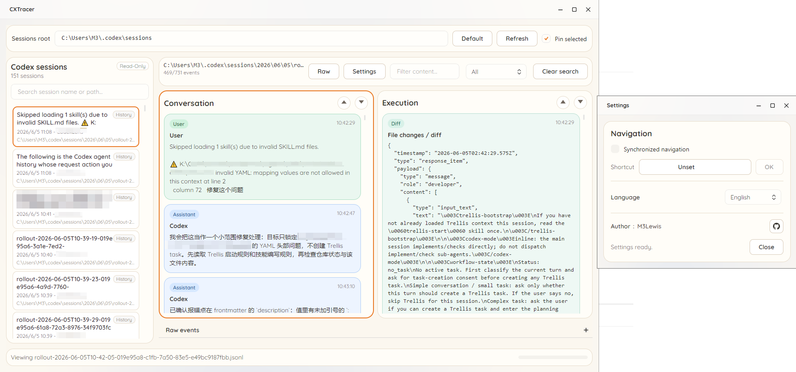

<p align="center">
  
</p>

<h1 align="center">CXTracer</h1>

<p align="center">
  <strong>High-Performance Codex Session Tracking & Analysis Tool</strong><br>
  <sub>A beautiful flat-designed desktop application based on .NET 8 and Avalonia</sub>
</p>

<p align="center">
  <a href="LICENSE"></a>
  
  
  
  
  <a href="https://deepwiki.com/M3Lewis/CXTracer"></a>
</p>

<p align="center">
  <a href="README.md">简体中文</a> | <a href="README.en.md">English</a>
</p>

---



A Multi-Platform, extremely fast session viewer for Codex CLI.

By scanning and monitoring `~/.codex/sessions/**/*.jsonl` in the background, CXTracer displays Codex conversation threads and execution tracks in an elegant, real-time two-column layout (Conversation & Execution) to provide a seamless auditing experience.

---

## Tech Stack

- **.NET 8** (leveraging modern C# syntax and native Native AOT support)
- **Avalonia 12.0.4** (cross-platform desktop UI framework)
- **SukiUI 7.0.1** (a stunning flat design based on the `Orange` theme, supporting real-time English and Simplified Chinese i18n switching)
- **CommunityToolkit.Mvvm 8.4.0** (highly efficient MVVM implementation utilizing C# Source Generators)

---

## Core Features & Design Architecture

Based on the architecture of the `src` codebase, CXTracer implements the following core features and technical designs:

### 1. Dual-Column Layout & Heuristic Event Classification
Since Codex's JSONL format is not a public, static API, the `CodexEventParser` uses **flattening** and **wide-aperture heuristics** to scan JSON line fields and match events using regex classification.
* **Left Column (Conversation)**: Displays `User`, `Assistant`, and `Final` events. This keeps only user prompts and Codex's final textual responses visible.
* **Right Column (Execution)**: Displays `Command`, `CommandOutput`, `Diff`, `Tool`, and `Error` events. This shows shell execution, tool invocations, file change patches (Diffs), and system errors.
* **Collapsible Bottom Panel (Raw events)**: Reasoning/thought processes (`Reasoning`/`Thought`) and updates plans (`Plan`) are hidden from the columns by default and are only shown in the collapsible bottom area to keep the main view clean.

### 2. Synchronized Navigation
* **Time & Line Alignment**: When synchronized navigation is enabled, moving up/down in either column (via UI buttons or arrow keys) will automatically scroll/position the other column to its corresponding companion event based on `Timestamp` or `LineNumber`.
* **Custom Shortcut Keys**: Supports capturing and binding custom global shortcut keys (e.g., `Ctrl + Shift + S`) which can be recorded and saved immediately in the Settings window.
* **Configuration Persistence**: User preferences (such as synchronization state and shortcut keys) are serialized into `settings.json` located under `%LOCALAPPDATA%\CXTracer\`. This configuration is fully compatible with **Native AOT** compilation, using source generators (`AppJsonContext`) instead of runtime reflection.

### 3. High-Performance Real-Time Live Tail
* **File Change Monitoring**: Utilizes `FileSystemWatcher` to monitor changes in the sessions directory, prompting debounced refresh events through the `SessionWatcher`.
* **Incremental Stream Reading**: `SessionReader` **does not reload the entire file** when updates occur. It tracks the last read byte offset (`Offset`), directly seeks to it, and reads new UTF-8 data using a low-level byte buffer. It also caches incomplete lines (`Pending`) to stitch them together during the next update, drastically reducing I/O overhead.
* **Pin Selected Session**: If multiple Codex processes are writing sessions concurrently, users can check "Pin selected" at the top. This keeps the viewer focused on the current session without letting new session file events steal selection focus.

### 4. Session Previews & File Path Copying
* **Metadata Rich Cards**: The session list cards dynamically display the last modified time, extract the first user prompt line as the Title, infer the project name from the current working directory (`cwd` Project Hint), and tag the session state as `LIVE` / `Active` / `History`.
* **Path Hover & Clipboard**: Hovering over the active session's file path displays a tooltip containing the full path. Clicking or right-clicking copies the absolute path to the clipboard with a SukiUI toast notification.

### 5. Detailed Message Popup Overlay
* **Quick Log Reading**: To address narrow-column reading constraints for long text (e.g., full Assistant replies, verbose console output, or complex tool payloads), clicking any message card opens a detailed popup overlay.
* **Darkened Backdrop & Raw JSON**: The overlay features a semi-transparent dark backdrop and sets the card background based on its role theme. It features a collapsible **Raw JSON** expander to examine the original JSON payload. Close the overlay by pressing `Esc`, clicking outside the popup, or clicking the close button in the top-right corner.

### 6. Dynamic i18n Translation Switching
* **Seamless Switching**: Supports real-time toggling between English and Simplified Chinese. Changes in the Settings window instantly update all static text, calculated values (e.g., session counts, event counts), copy toasts, and filter dropdowns using Avalonia's `MergedDictionaries` without requiring an application restart.
* **Smart UI Locale Detection**: On first launch (when no local settings file exists), the application automatically detects the system's UI language. If `zh` is detected, it defaults to the Simplified Chinese interface.
* **Full Native AOT Compatibility**: Translation data is structured to avoid runtime reflection, aligning with Native AOT tree-shaking compilation.

### 7. Strict Read-Only Security Boundary
The application uses only read-only system APIs to ensure strict process boundaries:
* Calls only `Directory.EnumerateFiles` and `FileSystemWatcher`.
* Opens file streams using `FileShare.ReadWrite | FileShare.Delete` sharing flags to avoid locking files write-accessed by the active Codex process.
* **Never modifies** files under `~/.codex`, **never creates** local database indexes, and **never uploads** data to external networks.

---

## Compilation & Run

### Run Developer Environment

```powershell
dotnet restore .\CXTracer.sln
dotnet run --project .\src\CXTracer\CXTracer.csproj
```

### Multi-Platform Native AOT Build

Native AOT compilation targets specific machine architectures and requires local build-tool chains. Therefore, you should build on the corresponding target operating system.

#### 1. Prerequisites

* **Windows**: Install Visual Studio with the "Desktop development with C++" workload (MSVC and Windows SDK).
* **macOS**: Install Xcode Command Line Tools:
  ```bash
  xcode-select --install
  ```
* **Linux (e.g., Ubuntu)**: Install Clang compiler and developer libraries:
  ```bash
  sudo apt-get update
  sudo apt-get install -y clang zlib1g-dev libkrb5-dev
  ```

#### 2. Build Commands

Run the following commands in the root directory. The compiled single-file binary does not require the .NET runtime to run, is deeply trimmed/shrunk, and starts instantly:

##### Windows (x64)
```powershell
dotnet publish .\src\CXTracer\CXTracer.csproj -c Release -r win-x64 --self-contained -p:PublishAot=true
# Publish directory: src\CXTracer\bin\Release\net8.0\win-x64\publish
```

##### macOS Apple Silicon (ARM64)
```bash
dotnet publish ./src/CXTracer/CXTracer.csproj -c Release -r osx-arm64 --self-contained -p:PublishAot=true
# Publish directory: src/CXTracer/bin/Release/net8.0/osx-arm64/publish
```

##### macOS Intel (x64)
```bash
dotnet publish ./src/CXTracer/CXTracer.csproj -c Release -r osx-x64 --self-contained -p:PublishAot=true
# Publish directory: src/CXTracer/bin/Release/net8.0/osx-x64/publish
```

##### Linux (x64)
```bash
dotnet publish ./src/CXTracer/CXTracer.csproj -c Release -r linux-x64 --self-contained -p:PublishAot=true
# Publish directory: src/CXTracer/bin/Release/net8.0/linux-x64/publish
```

---

## Search & Filtering

* **Independent Search Input**:
  * **Session Filter (Left Column)**: The input box above the sidebar filters the sessions list by title, subtitle, or file paths in real-time.
  * **Log Filter (Right Column)**: An input box to the left of the event filter dropdown matches keywords inside event body contents.
* **Event Type Filters**: Quickly toggle views between `All` / `Conversation` / `Commands` / `Errors` / `Diffs` / `Final` / `Tools` / `Raw`.

---

## WSL & Cross-Environment Support

If you run Codex in a WSL (e.g., Ubuntu) environment while CXTracer runs in Windows, copy and paste your WSL network share path into the **Sessions root** field.

For example:
```text
\\wsl.localhost\Ubuntu\home\username\.codex\sessions
```
Click **Refresh** to load the files, start background listeners, and receive Live tail additions.

---

## Sample Data

Use `samples/sample-rollout.jsonl` as a reference testing file. Copy it to your sessions directory to inspect the parsing and dual-column interface layout.

## Special Thanks

* [mindfold-ai/Trellis](https://github.com/mindfold-ai/Trellis)
* [LINUX DO](https://linux.do/)

---

## License

This project is open-sourced under the **GNU Affero General Public License v3.0 (AGPL-3.0)**. For details, see the [LICENSE](LICENSE) file.
