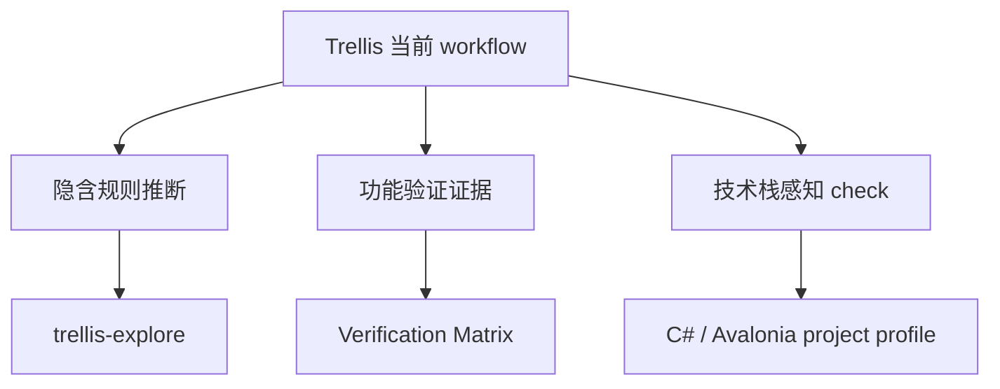
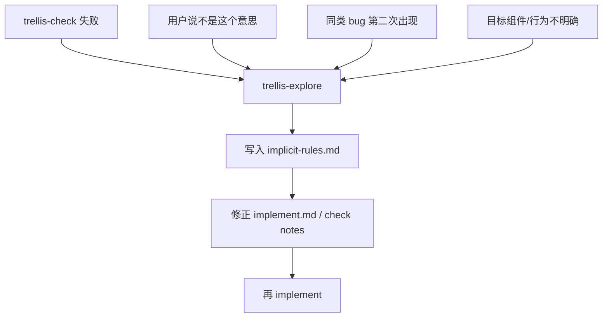
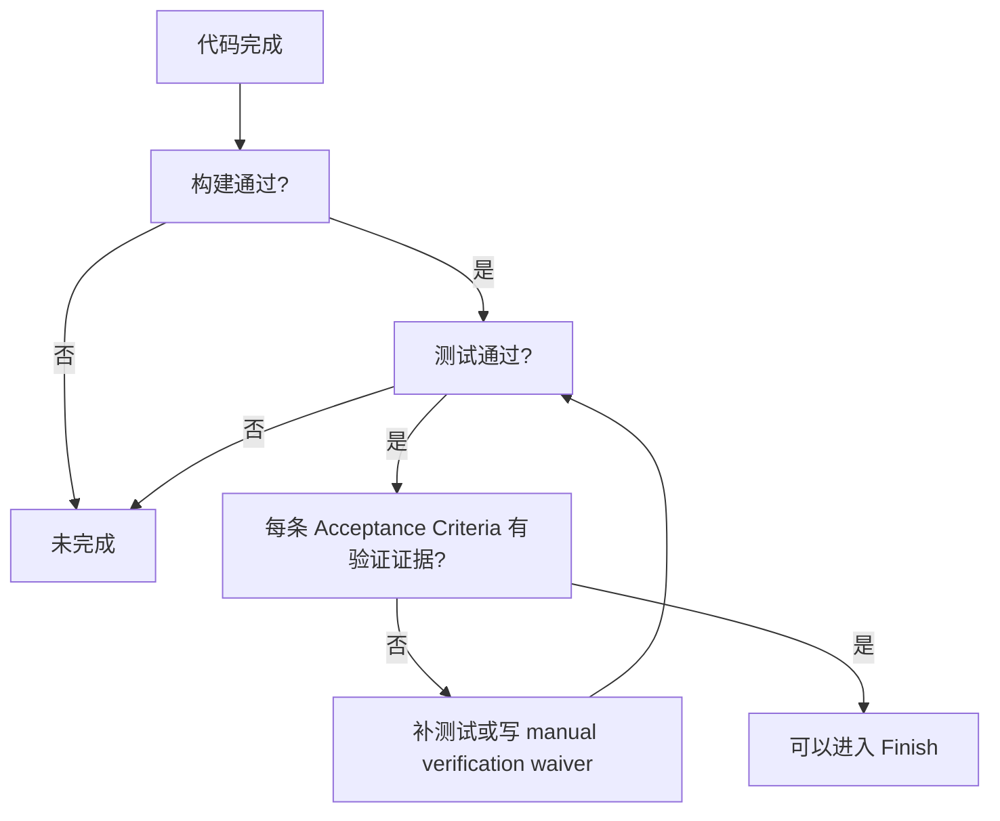
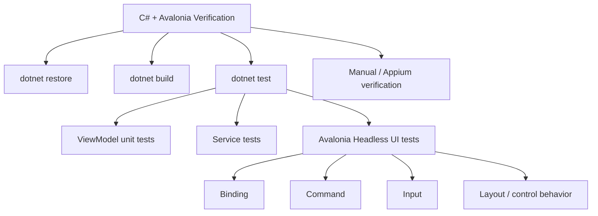
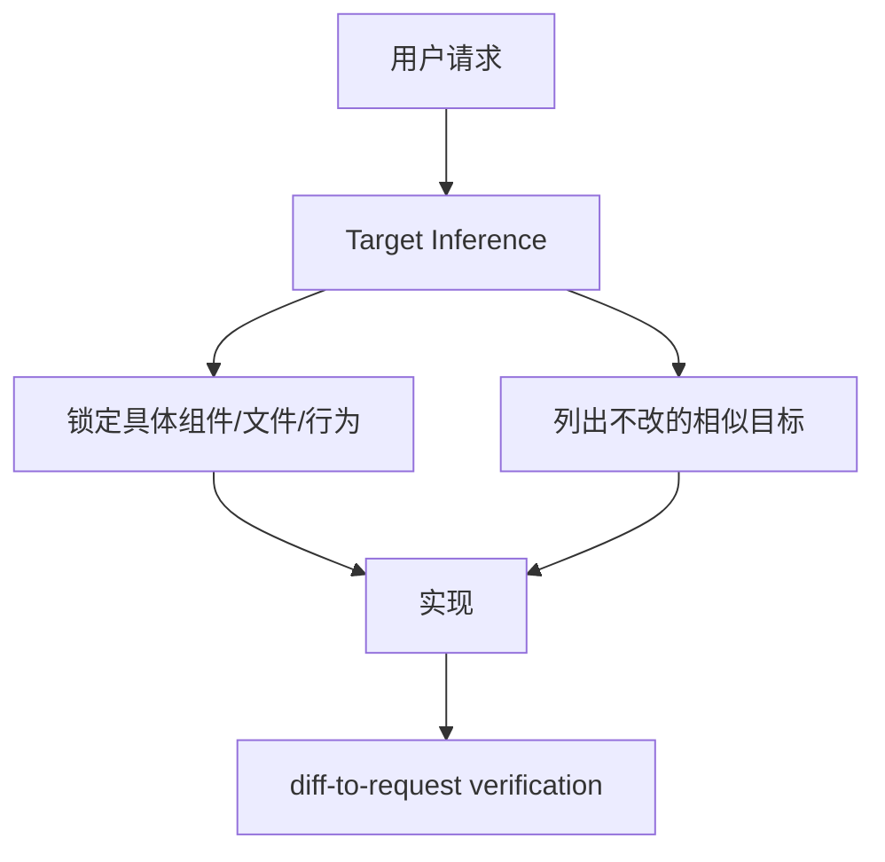
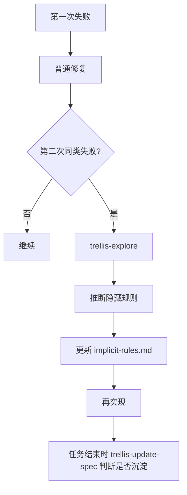
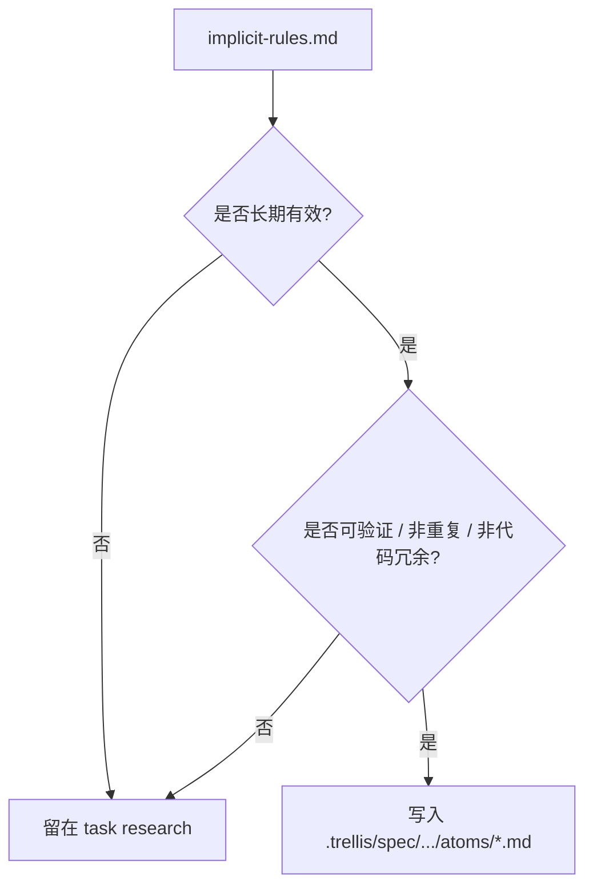

下面是我们前面讨论过的 **Trellis workflow 改进点汇总版**。核心方向是：把 Trellis 从“按流程执行 + 编译检查”升级为 **隐含规则推断 + 功能验证证据 + 技术栈感知检查**。

---

## 总目标

现有 Trellis 已经有很好的基础：Plan before code、spec 注入、持久化任务文件、增量开发、任务结束后沉淀经验。它还已经规定每个任务有 `prd.md`、可选 `design.md` / `implement.md` / `research/`，并通过 `trellis-implement -> trellis-check -> trellis-update-spec -> commit` 串起执行流程。

我们要补的是三类能力：



---

# 1. 引入 TTExplore 思想：新增 `trellis-explore`

## 要解决的问题

Agent 有时不是不会写代码，而是不知道隐藏规则：

* 用户真实意图没有被正确映射到组件 / 文件 / 行为
* 项目里有隐含架构约定
* 测试失败原因不明显
* 同一个 bug 反复修
* `trellis-check` 失败后直接返工，缺少中间复盘

## 改进方案

新增一个 Thinker 型 skill：

```text
trellis-explore
```

它不直接写代码，而是读取：

* 当前 task artifacts
* `prd.md`
* `design.md`
* `implement.md`
* diff
* 测试失败
* 用户纠正
* spec
* research

然后推断隐含规则，并写入：

```text
.trellis/tasks/<task>/research/implicit-rules.md
```

推荐结构：

```md
# Implicit Rules Exploration

## Trigger
为什么触发 explore：测试失败 / 用户纠正 / 重复调试 / 目标不清

## Observed Evidence
看到的证据：报错、diff、用户原话、失败测试

## Inferred Hidden Rules
推断出的隐藏规则

## Action Guidance
下一轮 implement 应该怎么改，什么不要改

## Confidence
High / Medium / Low
```

## 触发条件

不建议每一步都跑。只在这些情况下触发：



---

# 2. 把 `trellis-check` 从“编译通过”升级成“功能验证通过”

## 要解决的问题

现在 `trellis-check` 容易把：

```text
lint pass
typecheck pass
build pass
```

误判成：

```text
功能正确
```

但这两者不是一回事。

## 改进方案

新增硬门槛：**Verification Matrix**。

`trellis-check` 必须把每条需求 / 验收标准映射到验证证据：

```md
## Verification Matrix

| Requirement / Acceptance Criteria | Verification Type | Evidence | Status |
|---|---|---|---|
| 点击保存后显示成功提示 | unit / integration | SaveViewModelTests.cs | ✅ |
| 保存失败后显示错误信息 | unit / headless UI | SaveViewHeadlessTests.cs | ✅ |
| loading 时不能重复提交 | unit / headless UI | SaveCommandTests.cs | ✅ |
```

## 新的通过标准



关键规则：

```text
build / lint / typecheck passing is necessary but never sufficient.
```

---

# 3. PRD 和 implement 阶段前置测试计划

## 要解决的问题

如果测试计划在 check 阶段才想，往往已经太晚，Agent 会倾向于只证明“代码能编译”。

## 改进方案

在 `prd.md` 里强化：

```md
## Acceptance Criteria
- ...
- ...
```

在 `implement.md` 里新增：

```md
## Test Plan

| Acceptance Criteria | Test Level | Test File / Command | Notes |
|---|---|---|---|
| ... | unit | ... | ... |
| ... | integration | ... | ... |
| ... | manual | ... | 自动化不现实的原因 |
```

然后 `trellis-implement` 的职责改成：

```text
实现代码 + 添加/更新对应测试
```

`trellis-check` 的职责改成：

```text
验证代码、测试、Verification Matrix 三者一致
```

---

# 4. 增加技术栈感知：不要默认 TypeScript

## 要解决的问题

当前 workflow 文案里多次出现 lint / type-check，这容易让 agent 默认走 TS / Node 项目的验证路径。对你常用的 **C# + Avalonia**，这会明显打折扣。

## 改进方案

新增：

```text
.trellis/project-profile.md
```

示例：

```md
# Project Profile

## Stack
- Language: C#
- Runtime: .NET
- UI: Avalonia
- Test Framework: xUnit or NUnit

## Validation Commands
- Restore: dotnet restore
- Build: dotnet build --configuration Release --no-restore
- Test: dotnet test --configuration Release --no-build
- Format: dotnet format --verify-no-changes

## Testing Strategy
- ViewModels: unit tests
- Services: unit / integration tests
- Avalonia controls/windows: Avalonia.Headless.XUnit or Avalonia.Headless.NUnit
- Critical platform UI flows: Appium or documented manual verification
```

## `trellis-check` 新规则

```text
Do not assume TypeScript / Node validation.
First read .trellis/project-profile.md or detect project stack.
For C# / .NET, run dotnet build and dotnet test.
For Avalonia UI behavior, consider unit tests, headless UI tests, Appium, or manual verification.
dotnet build passing is necessary but never sufficient.
```

---

# 5. 针对 C# + Avalonia 的验证分层

推荐分层：



建议规则：

| 改动类型                                | 推荐验证                                     |
| ----------------------------------- | ---------------------------------------- |
| ViewModel command / state           | unit test                                |
| service / business logic            | unit or integration test                 |
| binding / button / command behavior | Avalonia headless test                   |
| native dialog / OS integration      | Appium or manual verification            |
| purely visual polish                | screenshot/manual verification 可接受，但要写清楚 |

---

# 6. 强化 direct edit 的“目标锁定”能力

Trellis 现在已经有 direct edit safeguard：编辑前锁定确切目标，说明 negative scope；编辑后对照用户原话和截图验证 diff。

可以把它升级成更通用的“隐含规则推断”：



这可以减少“改了旁边那个相似按钮/组件”的问题。

---

# 7. 把 repeated debugging 从事后复盘提前到事中

当前 Trellis 有 `trellis-break-loop`，主要用于 repeated debugging 的 retrospective。我们建议保留它，但新增更早的触发：



也就是说：

* `trellis-explore`：事中推断规则，减少继续乱试
* `trellis-break-loop`：事后复盘，沉淀长期经验

---

# 8. 更新 workflow breadcrumb

在 `[workflow-state:in_progress]` 中加入类似规则：

```md
Flow: `trellis-implement` -> `trellis-check` -> optional `trellis-explore` on failure/ambiguity/repeated debugging -> `trellis-update-spec` -> commit -> finish.

If check fails, user corrects the target, or the same issue repeats twice,
run `trellis-explore` before another implementation attempt.

Persist inferred hidden rules to the active task before editing again.
```

这样 hook 每轮注入状态时，Agent 会记得：失败后不是无脑再实现，而是先推断规则。

---

# 9. 更新 Phase 2 文案

## Phase 2.1 Implement 改成

```md
Before coding, derive a test plan from `prd.md`.
Implement the reviewed task artifacts and add/update the smallest appropriate tests.
Finish by running the project-specific validation commands from `.trellis/project-profile.md`.
```

## Phase 2.2 Quality check 改成

```md
Build a Verification Matrix mapping every acceptance criterion and user-visible behavior change to evidence.

Evidence must be one of:
1. new automated unit/integration/e2e/headless test,
2. existing automated test with exact command/name,
3. documented manual verification with reason automation is not practical.

Do not mark the task complete solely because lint/type-check/build passes.
```

## Phase 2.3 Rollback 改成

```md
If failure cause is unclear or repeated, run `trellis-explore` before returning to implementation.
Write findings to `research/implicit-rules.md`.
```

---

# 10. 更新 spec 沉淀机制

任务结束时，`trellis-update-spec` 不应该把所有 explore 发现都写入 spec。

它应该经过 curator gate：



也就是：

* 临时任务经验 → 留在 task
* 长期项目规则 → 进入 spec atom
* 不确定推断 → 不沉淀

---

# 最小落地版本

我建议第一版只做 5 个改动：

```text
1. 新增 .trellis/project-profile.md
2. 新增 trellis-explore skill
3. 新增 research/implicit-rules.md 约定
4. 修改 trellis-check：必须输出 Verification Matrix
5. 修改 Phase 2：build/typecheck 不是完成标准，必须有功能验证证据
```

最终目标可以概括成一句话：

> **Trellis 不再问“代码是否编译通过”，而是问“用户需求是否被证据证明已经实现”。**
